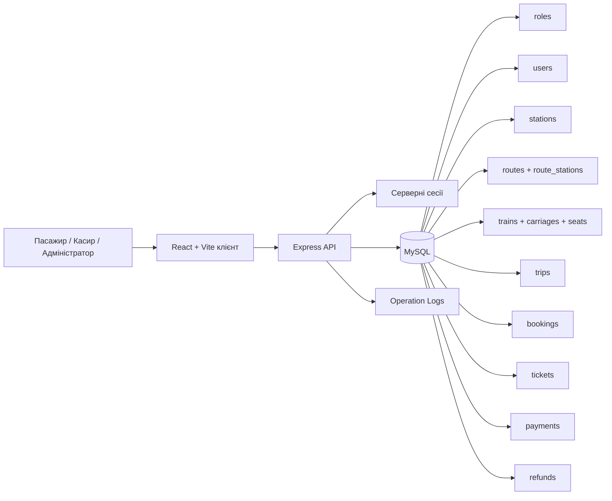

# Система бронювання, продажу та повернення залізничних квитків

Вебзастосунок для дипломного проєкту, що автоматизує основні процеси роботи із залізничними квитками: пошук рейсів, вибір місць, бронювання, оплату, повернення та адміністративне керування довідниками й розкладом.

## Тема роботи

Інформаційна система автоматизації процесів бронювання, продажу та повернення залізничних квитків.

## Мета проєкту

Розробити прикладну систему для залізничного вокзалу, у якій:

- пасажир може знайти рейс, забронювати місце, оплатити квиток і переглянути історію поїздок;
- касир може оформити продаж або повернення для пасажира;
- адміністратор може керувати станціями, маршрутами, поїздами, вагонами, рейсами та цінами;
- система не допускає подвійного бронювання або продажу одного й того самого місця.

## Технології

- `client` - React + Vite
- `server` - Node.js + Express
- `db` - MySQL
- доступ до БД - `mysql2`
- автентифікація - серверні сесії та cookie
- стилі - CSS Modules
- деплой - GitHub + Railway

## Структура репозиторію

```text
.
|-- client/      # клієнтський застосунок
|-- server/      # REST API та бізнес-логіка
|-- db/          # SQL-схема, сиди, smoke-checks
|-- docs/        # проєктна документація
|-- scripts/     # утиліти ініціалізації та обслуговування
|-- .railway/    # конфігурація Railway
`-- about.txt    # короткий опис проєкту
```

## Основні ролі

- `passenger` - пошук рейсів, бронювання, оплата, перегляд і повернення квитків.
- `cashier` - оформлення продажів і повернень у службовому інтерфейсі.
- `admin` - керування довідниками, рейсами, рухомим складом і перегляд службових журналів.

## Основні сценарії

1. Користувач обирає станцію відправлення, станцію прибуття та дату.
2. Система показує доступні рейси з ціною, часом і кількістю вільних місць.
3. Пасажир відкриває схему вагонів, вибирає місце та створює бронювання.
4. Після успішної оплати бронювання переходить у статус оплаченого квитка.
5. За потреби пасажир або касир може оформити повернення до відправлення рейсу.
6. Адміністратор керує довідниками, поїздами, маршрутами та рейсами.

## Архітектурна схема



## Модель даних

Ключові сутності:

- `roles`
- `users`
- `stations`
- `routes`
- `route_stations`
- `trains`
- `carriages`
- `seats`
- `trips`
- `bookings`
- `tickets`
- `payments`
- `refunds`
- `operation_logs`

Ключове бізнес-правило цілісності: у таблиці `bookings` використовується обчислюване поле `active_trip_seat_key` з унікальним індексом, що не дозволяє одночасно мати дві активні броні або продажі для однієї комбінації `trip + carriage + seat`.

## Корисні файли по базі даних

- схема БД: [db/schema.sql](C:/Users/PAPA/Downloads/diploma/db/schema.sql)
- тестові дані: [db/seeds.sql](C:/Users/PAPA/Downloads/diploma/db/seeds.sql)
- ручні smoke-checks: [db/smoke-checks.sql](C:/Users/PAPA/Downloads/diploma/db/smoke-checks.sql)
- опис моделі даних: [docs/database-design.md](C:/Users/PAPA/Downloads/diploma/docs/database-design.md)
- опис демо-даних: [docs/demo-data.md](C:/Users/PAPA/Downloads/diploma/docs/demo-data.md)

## Документація

- архітектура: [docs/architecture.md](C:/Users/PAPA/Downloads/diploma/docs/architecture.md)
- контракти API: [docs/api-contracts.md](C:/Users/PAPA/Downloads/diploma/docs/api-contracts.md)
- проєктування БД: [docs/database-design.md](C:/Users/PAPA/Downloads/diploma/docs/database-design.md)
- демо-дані: [docs/demo-data.md](C:/Users/PAPA/Downloads/diploma/docs/demo-data.md)
- ручні перевірки: [docs/manual-checks.md](C:/Users/PAPA/Downloads/diploma/docs/manual-checks.md)
- статус MVP: [docs/mvp-status.md](C:/Users/PAPA/Downloads/diploma/docs/mvp-status.md)

## Локальний запуск

1. Встановити залежності:

```bash
npm install
```

2. Підняти MySQL через Docker:

```bash
npm run db:up
```

3. Заповнити `.env` за зразком `.env.example`.

4. Ініціалізувати БД:

```bash
npm run db:init
```

5. Запустити застосунок:

```bash
npm run dev
```

## Railway

Проєкт містить Railway-конфігурацію в [.railway/railway.ts](C:/Users/PAPA/Downloads/diploma/.railway/railway.ts). Для production-середовища важливо:

- використовувати `utf8mb4` у MySQL;
- передавати коректні `DB_*`, `CLIENT_ORIGIN` і `SESSION_SECRET`;
- ініціалізувати БД через `db/schema.sql` і `db/seeds.sql`;
- для вже пошкоджених seed-рядків можна використати [scripts/repair-seed-encoding.mjs](C:/Users/PAPA/Downloads/diploma/scripts/repair-seed-encoding.mjs).

## Поточний стан

Проєкт уже покриває базовий пасажирський цикл: пошук рейсу, вибір місця, бронювання, оплату, перегляд квитка та повернення. Окремі службові сценарії касира й адміністратора зафіксовані в документації та продовжують розвиватися.
