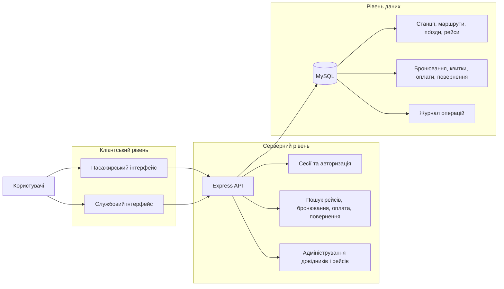

# Автоматизація процесів бронювання, продажу та повернення квитків залізничного вокзалу

Вебзастосунок для дипломного проєкту з автоматизації пошуку рейсів, бронювання місць, оплати, повернення квитків і базового адміністрування довідників та розкладу.

## Тема роботи

Інформаційна система автоматизації процесів бронювання, продажу та повернення залізничних квитків.

## Коротко про проєкт

Система покриває три основні ролі:

- `passenger` - пошук рейсів, вибір місця, бронювання, оплата, повернення;
- `cashier` - оформлення продажів і повернень у службовому інтерфейсі;
- `admin` - керування станціями, маршрутами, поїздами, вагонами та рейсами.

## Технології

- React + Vite
- Node.js + Express
- MySQL
- `mysql2`
- server-side sessions + cookie
- CSS Modules
- GitHub + Railway

## Архітектурна схема



## Важливі файли проєкту

### База даних

- схема БД: [db/schema.sql](C:/Users/PAPA/Downloads/diploma/db/schema.sql)
- тестові дані: [db/seeds.sql](C:/Users/PAPA/Downloads/diploma/db/seeds.sql)
- SQL-перевірки сценаріїв: [db/smoke-checks.sql](C:/Users/PAPA/Downloads/diploma/db/smoke-checks.sql)

### Документація

- архітектура: [docs/architecture.md](C:/Users/PAPA/Downloads/diploma/docs/architecture.md)
- контракти API: [docs/api-contracts.md](C:/Users/PAPA/Downloads/diploma/docs/api-contracts.md)
- проєктування БД: [docs/database-design.md](C:/Users/PAPA/Downloads/diploma/docs/database-design.md)

## Локальний запуск

```bash
npm install
npm run db:up
npm run db:init
npm run dev
```

Перед запуском потрібно заповнити `.env` за зразком `.env.example`.

## Примітка по Railway

Для production-середовища важливо використовувати `utf8mb4` у MySQL і ініціалізувати БД через `db/schema.sql` та `db/seeds.sql`.
